<div align="center">

<!-- Animated Header - Mint Green Pulse -->


<!-- Typing Animation -->
<a href="https://git.io/typing-svg">
  
</a>

<br/>

<!-- Profile Views & Followers -->

&nbsp;


</div>

---

## 🌿 The Story So Far...

```python
class NitishKumar:
    def __init__(self):
        self.name        = "Nitish Kumar"
        self.alias       = "NitishKumar.ai"
        self.location    = "Bangalore, India 🇮🇳"
        self.role        = "Data Science Student"
        self.passion     = ["Machine Learning", "NLP", "Data Storytelling"]
        self.current     = "Building cool stuff with data 🔥"
        self.ask_me_about = ["Python", "ML Models", "Data Analysis", "AI Projects"]

    def life_philosophy(self):
        return "Data is the new oil — and I'm learning to refine it. ⚗️"

me = NitishKumar()
print(me.life_philosophy())
```

> *"In God we trust. All others must bring data."* — W. Edwards Deming

---

## 🧠 What I'm Up To

<table>
<tr>
<td width="50%">

### 🔭 Currently Working On
- 🤖 **Fake News Detector** — NLP-powered misinformation classifier
- 📚 **Personal Learning Pro** — AI-assisted learning platform
- 🔐 **PC App Lock** — Security utility app

### 🌱 Currently Learning
- Deep Learning & Neural Networks
- Advanced Feature Engineering
- MLOps & Model Deployment
- LLMs & Prompt Engineering

</td>
<td width="50%">

### ⚡ Fun Facts
- 🎯 I believe every dataset has a story to tell
- 🌙 Best ideas come after midnight debugging sessions
- ☕ Coffee → Code → Commit → Repeat
- 🎬 I have a YouTube channel where I share my journey
- 📸 Catch my experiments on Instagram too!

### 🎯 2026 Goals
- [ ] Deploy 3 end-to-end ML projects
- [ ] Contribute to open source DS libraries
- [ ] Write technical blogs about my learnings
- [ ] Get hands dirty with Kaggle competitions

</td>
</tr>
</table>

---

## 🛠️ My Tech Arsenal

<div align="center">

### 🐍 Languages & Core


### 🤖 ML / AI Stack


### 📊 Data & Visualization


### 🧰 Tools & Platforms


</div>


## 📈 Data Science Skills Radar

```
Machine Learning      ████████████████░░░░  80%
Python / Pandas       ███████████████████░  90%
Data Visualization    ████████████████░░░░  80%
NLP / Text Analysis   ██████████████░░░░░░  70%
Deep Learning         ████████████░░░░░░░░  60%
SQL & Databases       ████████████████░░░░  78%
Feature Engineering   █████████████░░░░░░░  65%
MLOps / Deployment    ████████░░░░░░░░░░░░  40%  ← leveling up! 🚀
```

---

## 📊 GitHub Stats

<div align="center">


<br/>


</div>


## 📅 Contribution Graph

<div align="center">

</div>

---

## 🗺️ My Data Science Journey Roadmap

```mermaid
journey
    title Nitish's Data Science Adventure 🌿
    section Foundation
      Learn Python: 9: Me
      Master Pandas & NumPy: 8: Me
      Statistics & Math: 7: Me
    section Building Up
      Machine Learning: 8: Me
      NLP Projects: 7: Me
      Data Visualization: 8: Me
    section Current
      Deep Learning: 6: Me
      Real Projects (Fake News Detector): 9: Me
      Open Source Contributions: 5: Me
    section Next Stop
      MLOps & Deployment: 3: Me
      Kaggle Competitions: 4: Me
      Research Papers: 2: Me
```



---

## 🌐 Connect With Me

<div align="center">

[](https://github.com/StarkNitish)
[](https://instagram.com/nitish_stark/)
[](https://youtube.com/channel/UCd93OmRn1xVRGCx3_qo1u4Q)

</div>

---

<div align="center">

### 💬 Random Dev Quote


---


**⭐ Star my repos if you find them useful! Let's grow together. 🌱**

*Made with 💚 and a lot of ☕ by Nitish Kumar © 2026*

</div>
